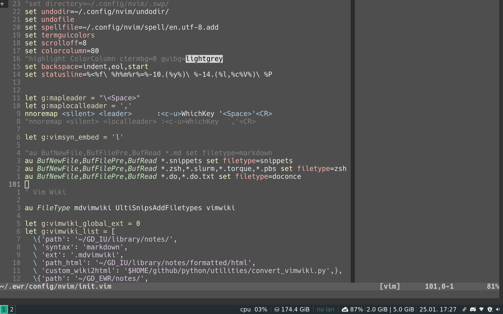

# About

All of the [seaborn](https://seaborn.pydata.org/) styles ported to vim color
schemes with the help of
[colorbuddy.nvim](https://github.com/tjdevries/colorbuddy.nvim)

There are a total or (185 themes)(light/dark)(normal/soft/hard contast) = 1110
variants in this repository!

# Installation

Using vim-plug

```{vim}
Plug 'tjdevries/colorbuddy.vim'
Plug 'erietz/vim-voodoo'
```

- Add the following to your `init.vim` to set a theme:
    - `lua require('colorbuddy').colorscheme('<any seaborn/matplotlib theme name>')`
    - `<any seaborn/matplotlib theme name>` is one of the file names in the `lua` directory.
- For a light variant of a them add this to your `init.vim`
    - `let g:voodoo_variant = 'light'`

# Adjusting a theme

- If you like a theme but something is a little off, 
    - Consider the reversed theme (For example: change the theme from `Dark2` to `Dark2_r`)
    - Set the contrast to `soft` or `hard` using `let g:voodoo_contrast = soft`
- You can also change the `template.lua` file and run the `colors.py` script
to regenerate all of the colorschemes.

# Problems

- [ ] Only works with neovim?
- [ ] All themes are based off of the template.lua file which is a work in progress.
- [ ] The assignments from seaborn colors to vim syntax elements are random
- [x] Add light and dark variants. (Some themes look terrible with current background.)

# Screenshots

- Set3 theme with a dark background

- Dark2 theme with a light background

- Pastel1 theme with a lower contrast

