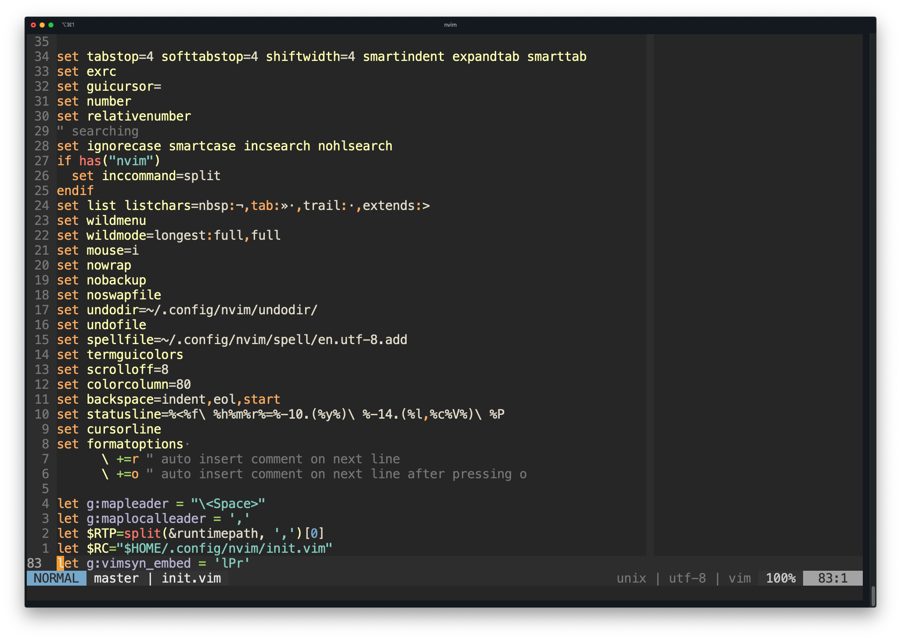

# About

All of the [seaborn](https://seaborn.pydata.org/) styles ported to vim color
schemes with the help of
[colorbuddy.nvim](https://github.com/tjdevries/colorbuddy.nvim)

There are a total or (185 themes)(light/dark)(normal/soft/hard contast) = 1110
variants in this repository!

This is a work in progress...

## Rationalizations

- There should be enough contrast such that text is legible
- There should not be so much contrast that your eyes burn
- Dark themes are better but sometimes the sun makes it impossible to see your
  monitor
- Strings and functions should be differentiable from each other and from
  everything else
- If there are too many highlight groups, it makes it difficult distinguish
  data types. For example:
  - Floats and numbers should be the same color
  - Keywords should be the same color

# Installation

Using vim-plug

```{vim}
Plug 'tjdevries/colorbuddy.vim'
Plug 'erietz/vim-voodoo'
```

- Add the following to your `init.vim` to set a theme:
    - `lua require('colorbuddy').colorscheme('<any seaborn/matplotlib theme name>')`
    - `<any seaborn/matplotlib theme name>` is one of the file names in the `lua` directory.
- For a light variant of a them add this to your `init.vim`
    - `let g:voodoo_variant = 'light'`

# Adjusting a theme

- If you like a theme but something is a little off, 
    - Consider the reversed theme (For example: change the theme from `Dark2` to `Dark2_r`)
    - Set the contrast to `soft` or `hard` using `let g:voodoo_contrast = soft`
- You can also change the `template.lua` file and run the `colors.py` script
to regenerate all of the colorschemes.

# Problems

- [ ] Only works with neovim?
- [ ] All themes are based off of the template.lua file which is a work in progress.
- [ ] The assignments from seaborn colors to vim syntax elements are random
- [x] Add light and dark variants. (Some themes look terrible with current background.)

# Screenshots

- Set3 theme with a dark background

- Dark2 theme with a light background

- Pastel1 theme with a lower contrast


# Contrast ratios

|                    |   visible_with_dark_background |   visible_with_light_background |
|:-------------------|-------------------------------:|--------------------------------:|
| Set3_r             |                              1 |                               0 |
| Set3               |                              1 |                               0 |
| Pastel2_r          |                              1 |                               0 |
| Wistia_r           |                              1 |                               0 |
| Set2_r             |                              1 |                               0 |
| Wistia             |                              1 |                               0 |
| Pastel1            |                              1 |                               0 |
| Pastel2            |                              1 |                               0 |
| Set2               |                              1 |                               0 |
| Pastel1_r          |                              1 |                               0 |
| pastel             |                              1 |                               0 |
| husl               |                              1 |                               0 |
| copper_r           |                              0 |                               0 |
| coolwarm_r         |                              0 |                               0 |
| gist_ncar_r        |                              0 |                               0 |
| gist_heat_r        |                              0 |                               0 |
| gist_gray_r        |                              0 |                               0 |
| gist_earth_r       |                              0 |                               0 |
| YlOrBr_r           |                              0 |                               0 |
| flag_r             |                              0 |                               1 |
| cubehelix_r        |                              0 |                               0 |
| YlOrRd_r           |                              0 |                               0 |
| afmhot_r           |                              0 |                               0 |
| autumn_r           |                              0 |                               0 |
| binary_r           |                              0 |                               0 |
| YlGnBu_r           |                              0 |                               0 |
| brg_r              |                              0 |                               0 |
| bwr_r              |                              0 |                               0 |
| cool_r             |                              0 |                               0 |
| bone_r             |                              0 |                               0 |
| magma              |                              0 |                               0 |
| YlGn_r             |                              0 |                               0 |
| gist_stern_r       |                              0 |                               0 |
| Greys_r            |                              0 |                               0 |
| OrRd_r             |                              0 |                               0 |
| Oranges_r          |                              0 |                               0 |
| PRGn_r             |                              0 |                               0 |
| PiYG_r             |                              0 |                               0 |
| PuBu_r             |                              0 |                               0 |
| PuBuGn_r           |                              0 |                               0 |
| PuOr_r             |                              0 |                               0 |
| PuRd_r             |                              0 |                               0 |
| Purples_r          |                              0 |                               0 |
| RdBu_r             |                              0 |                               0 |
| RdGy_r             |                              0 |                               0 |
| RdPu_r             |                              0 |                               0 |
| RdYlBu_r           |                              0 |                               0 |
| RdYlGn_r           |                              0 |                               0 |
| Reds_r             |                              0 |                               0 |
| Spectral_r         |                              0 |                               0 |
| gist_rainbow_r     |                              0 |                               0 |
| gray_r             |                              0 |                               0 |
| gist_yarg_r        |                              0 |                               0 |
| vlag_r             |                              0 |                               0 |
| tab20c_r           |                              0 |                               0 |
| rocket             |                              0 |                               0 |
| rocket_r           |                              0 |                               0 |
| mako               |                              0 |                               0 |
| mako_r             |                              0 |                               0 |
| icefire            |                              0 |                               0 |
| icefire_r          |                              0 |                               0 |
| vlag               |                              0 |                               0 |
| flare              |                              0 |                               0 |
| tab20_r            |                              0 |                               0 |
| flare_r            |                              0 |                               0 |
| crest              |                              0 |                               0 |
| crest_r            |                              0 |                               0 |
| hls                |                              0 |                               0 |
| deep               |                              0 |                               0 |
| dark               |                              0 |                               1 |
| muted              |                              0 |                               0 |
| bright             |                              0 |                               0 |
| tab20b_r           |                              0 |                               0 |
| tab10_r            |                              0 |                               0 |
| gnuplot_r          |                              0 |                               0 |
| prism_r            |                              0 |                               0 |
| gnuplot2_r         |                              0 |                               0 |
| GnBu_r             |                              0 |                               0 |
| hot_r              |                              0 |                               0 |
| hsv_r              |                              0 |                               0 |
| jet_r              |                              0 |                               0 |
| nipy_spectral_r    |                              0 |                               0 |
| ocean_r            |                              0 |                               0 |
| pink_r             |                              0 |                               0 |
| rainbow_r          |                              0 |                               0 |
| Set1_r             |                              0 |                               0 |
| seismic_r          |                              0 |                               0 |
| spring_r           |                              0 |                               0 |
| summer_r           |                              0 |                               0 |
| terrain_r          |                              0 |                               0 |
| winter_r           |                              0 |                               0 |
| Accent_r           |                              0 |                               0 |
| Dark2_r            |                              0 |                               0 |
| Paired_r           |                              0 |                               0 |
| Greens_r           |                              0 |                               0 |
| BuGn_r             |                              0 |                               0 |
| CMRmap_r           |                              0 |                               0 |
| copper             |                              0 |                               0 |
| Purples            |                              0 |                               0 |
| RdBu               |                              0 |                               0 |
| RdGy               |                              0 |                               0 |
| RdPu               |                              0 |                               0 |
| RdYlBu             |                              0 |                               0 |
| RdYlGn             |                              0 |                               0 |
| Reds               |                              0 |                               0 |
| Spectral           |                              0 |                               0 |
| YlGn               |                              0 |                               0 |
| YlGnBu             |                              0 |                               0 |
| YlOrBr             |                              0 |                               0 |
| YlOrRd             |                              0 |                               0 |
| afmhot             |                              0 |                               0 |
| autumn             |                              0 |                               0 |
| binary             |                              0 |                               0 |
| bone               |                              0 |                               0 |
| brg                |                              0 |                               0 |
| bwr                |                              0 |                               0 |
| cool               |                              0 |                               0 |
| PuRd               |                              0 |                               0 |
| PuOr               |                              0 |                               0 |
| PuBuGn             |                              0 |                               0 |
| BuGn               |                              0 |                               0 |
| plasma             |                              0 |                               0 |
| viridis            |                              0 |                               0 |
| cividis            |                              0 |                               0 |
| twilight           |                              0 |                               0 |
| twilight_shifted   |                              0 |                               0 |
| turbo              |                              0 |                               0 |
| Blues              |                              0 |                               0 |
| BrBG               |                              0 |                               0 |
| BuPu               |                              0 |                               0 |
| PuBu               |                              0 |                               0 |
| CMRmap             |                              0 |                               0 |
| GnBu               |                              0 |                               0 |
| Greens             |                              0 |                               0 |
| Greys              |                              0 |                               0 |
| OrRd               |                              0 |                               0 |
| Oranges            |                              0 |                               0 |
| PRGn               |                              0 |                               0 |
| PiYG               |                              0 |                               0 |
| coolwarm           |                              0 |                               0 |
| cubehelix          |                              0 |                               0 |
| BuPu_r             |                              0 |                               0 |
| flag               |                              0 |                               0 |
| Accent             |                              0 |                               0 |
| Dark2              |                              0 |                               0 |
| Paired             |                              0 |                               0 |
| Set1               |                              0 |                               0 |
| tab10              |                              0 |                               0 |
| tab20              |                              0 |                               0 |
| tab20b             |                              0 |                               0 |
| tab20c             |                              0 |                               0 |
| magma_r            |                              0 |                               0 |
| inferno_r          |                              0 |                               0 |
| plasma_r           |                              0 |                               0 |
| viridis_r          |                              0 |                               0 |
| cividis_r          |                              0 |                               0 |
| twilight_r         |                              0 |                               0 |
| twilight_shifted_r |                              0 |                               0 |
| turbo_r            |                              0 |                               0 |
| Blues_r            |                              0 |                               0 |
| BrBG_r             |                              0 |                               0 |
| inferno            |                              0 |                               0 |
| winter             |                              0 |                               0 |
| terrain            |                              0 |                               0 |
| summer             |                              0 |                               0 |
| gnuplot2           |                              0 |                               0 |
| gist_earth         |                              0 |                               0 |
| gist_gray          |                              0 |                               0 |
| gist_heat          |                              0 |                               0 |
| gist_ncar          |                              0 |                               0 |
| gist_rainbow       |                              0 |                               0 |
| gist_stern         |                              0 |                               0 |
| gist_yarg          |                              0 |                               0 |
| gnuplot            |                              0 |                               0 |
| gray               |                              0 |                               0 |
| spring             |                              0 |                               0 |
| hot                |                              0 |                               0 |
| hsv                |                              0 |                               0 |
| nipy_spectral      |                              0 |                               0 |
| ocean              |                              0 |                               0 |
| pink               |                              0 |                               0 |
| prism              |                              0 |                               0 |
| rainbow            |                              0 |                               0 |
| seismic            |                              0 |                               0 |
| colorblind         |                              0 |                               0 |
