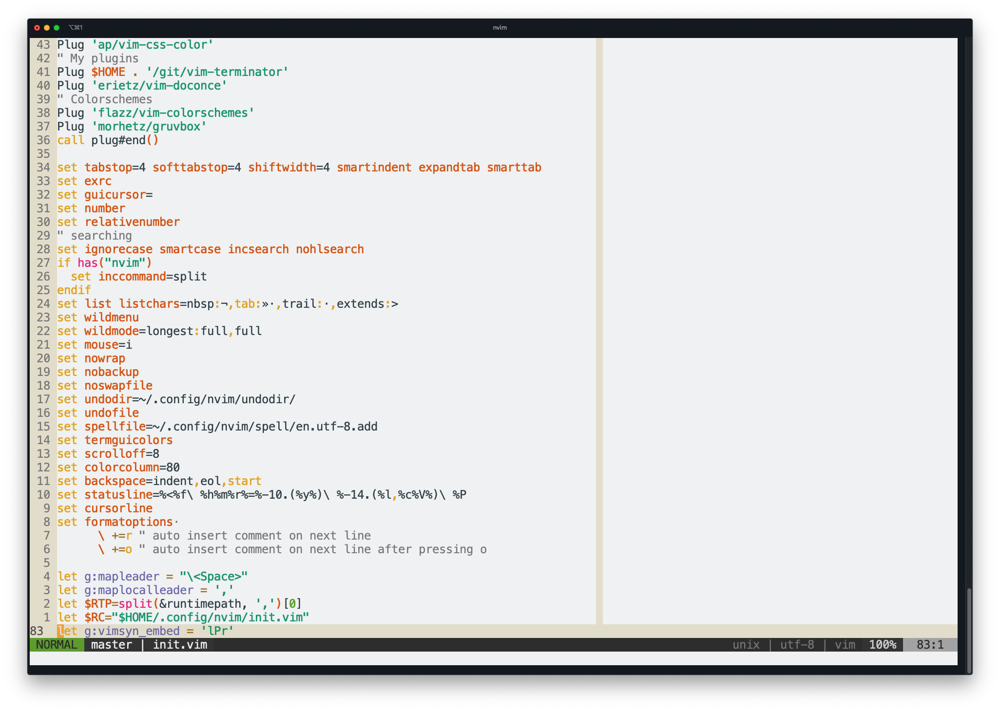

# About

All of the [seaborn](https://seaborn.pydata.org/) styles ported to vim color
schemes with the help of
[colorbuddy.nvim](https://github.com/tjdevries/colorbuddy.nvim)

There are a total or (185 themes)(light/dark)(normal/soft/hard contast) = 1110
variants in this repository!

This is a work in progress...

## Rationalizations

- There should be enough contrast such that text is legible
- There should not be so much contrast that your eyes burn
- Dark themes are better but sometimes the sun makes it impossible to see your
  monitor
- Strings and functions should be differentiable from each other and from
  everything else
- If there are too many highlight groups, it makes it difficult distinguish
  data types. For example:
  - Floats and numbers should be the same color
  - Keywords should be the same color

# Installation

Using vim-plug

```{vim}
Plug 'tjdevries/colorbuddy.vim'
Plug 'erietz/vim-voodoo'
```

- Add the following to your `init.vim` to set a theme:
    - `lua require('colorbuddy').colorscheme('<any seaborn/matplotlib theme name>')`
    - `<any seaborn/matplotlib theme name>` is one of the file names in the `lua` directory.
- For a light variant of a them add this to your `init.vim`
    - `let g:voodoo_variant = 'light'`

# Adjusting a theme

- If you like a theme but something is a little off, 
    - Consider the reversed theme (For example: change the theme from `Dark2` to `Dark2_r`)
    - Set the contrast to `soft` or `hard` using `let g:voodoo_contrast = soft`
- You can also change the `template.lua` file and run the `colors.py` script
to regenerate all of the colorschemes.

# Problems

- [ ] Only works with neovim?
- [ ] All themes are based off of the template.lua file which is a work in progress.
- [ ] The assignments from seaborn colors to vim syntax elements are random
- [x] Add light and dark variants. (Some themes look terrible with current background.)

# Screenshots

- Set3 theme (my personal favorite)

- husl theme

- Pastel2 theme with a lower contrast

- Dark2 theme with a light background (who uses a light background?)


# Contrast ratios

The WCAG says that contrast ratio should be 4.5:1 between the foreground and
background to be able to clearly read text. The following table summarizes
the ratios for the three backgrounds. The columns with "all_colors_visible"
have a ratio greater than 4.5:1 for every color in the palette. The columns
with "average_contrast" are the average of the contrasts calculated for each
color in the palette. More detailed tables are provided under `./tables`

|                    | normal_all_colors_visible   |   normal_average_contrast | hard_all_colors_visible   |   hard_average_contrast | soft_all_colors_visible   |   soft_average_contrast |
|:-------------------|:----------------------------|--------------------------:|:--------------------------|------------------------:|:--------------------------|------------------------:|
| Pastel2_r          | True                        |                  10.7052  | True                      |                13.9963  | True                      |                8.59997  |
| Pastel2            | True                        |                  10.7052  | True                      |                13.9963  | True                      |                8.59997  |
| Set2               | True                        |                   7.34343 | True                      |                 9.60095 | False                     |                5.89928  |
| Wistia             | True                        |                   8.8842  | True                      |                11.6154  | True                      |                7.13705  |
| Spectral           | False                       |                   8.05352 | True                      |                10.5293  | False                     |                6.46973  |
| Set3               | True                        |                   8.35457 | True                      |                10.9229  | True                      |                6.71158  |
| Pastel1_r          | True                        |                  10.6151  | True                      |                13.8784  | True                      |                8.52758  |
| summer_r           | False                       |                   6.85105 | True                      |                 8.9572  | False                     |                5.50373  |
| autumn             | False                       |                   6.32776 | True                      |                 8.27304 | False                     |                5.08335  |
| Set2_r             | True                        |                   7.34343 | True                      |                 9.60095 | False                     |                5.89928  |
| Set3_r             | True                        |                   9.49701 | True                      |                12.4166  | True                      |                7.62934  |
| spring_r           | False                       |                   6.572   | True                      |                 8.59236 | False                     |                5.27956  |
| tab20_r            | False                       |                   6.03467 | True                      |                 7.88985 | False                     |                4.8479   |
| autumn_r           | False                       |                   6.29068 | True                      |                 8.22456 | False                     |                5.05357  |
| Wistia_r           | True                        |                   8.91224 | True                      |                11.652   | True                      |                7.15958  |
| cool               | False                       |                   5.22578 | True                      |                 6.83229 | False                     |                4.19808  |
| coolwarm           | False                       |                   7.05638 | True                      |                 9.22566 | False                     |                5.66869  |
| coolwarm_r         | False                       |                   7.05667 | True                      |                 9.22604 | False                     |                5.66892  |
| summer             | False                       |                   6.89173 | True                      |                 9.01039 | False                     |                5.53641  |
| pastel             | True                        |                   8.20024 | True                      |                10.7212  | True                      |                6.58759  |
| husl               | True                        |                   5.15598 | True                      |                 6.74103 | False                     |                4.14202  |
| cool_r             | False                       |                   5.25183 | True                      |                 6.86635 | False                     |                4.21902  |
| spring             | False                       |                   6.60533 | True                      |                 8.63594 | False                     |                5.30634  |
| Pastel1            | True                        |                  10.213   | True                      |                13.3527  | True                      |                8.20455  |
| vlag_r             | False                       |                   7.36319 | True                      |                 9.62679 | False                     |                5.91516  |
| vlag               | False                       |                   7.36085 | True                      |                 9.62373 | False                     |                5.91328  |
| binary_r           | False                       |                   4.57057 | False                     |                 5.97565 | False                     |                3.67173  |
| bwr_r              | False                       |                   6.81471 | False                     |                 8.90969 | False                     |                5.47455  |
| copper_r           | False                       |                   3.56883 | False                     |                 4.66596 | False                     |                2.86699  |
| cubehelix_r        | False                       |                   4.58337 | False                     |                 5.99239 | False                     |                3.68201  |
| flag_r             | False                       |                   1.11621 | False                     |                 1.45935 | False                     |                0.896696 |
| gist_earth_r       | False                       |                   4.45126 | False                     |                 5.81966 | False                     |                3.57588  |
| gist_gray_r        | False                       |                   4.51872 | False                     |                 5.90787 | False                     |                3.63008  |
| bone_r             | False                       |                   4.43925 | False                     |                 5.80396 | False                     |                3.56623  |
| brg_r              | False                       |                   2.91229 | False                     |                 3.80758 | False                     |                2.33956  |
| magma              | False                       |                   3.60564 | False                     |                 4.71409 | False                     |                2.89656  |
| afmhot_r           | False                       |                   6.5541  | False                     |                 8.56896 | False                     |                5.26518  |
| RdGy_r             | False                       |                   6.95256 | False                     |                 9.08992 | False                     |                5.58528  |
| PRGn_r             | False                       |                   7.1144  | False                     |                 9.30151 | False                     |                5.7153   |
| PiYG_r             | False                       |                   8.09358 | False                     |                10.5817  | False                     |                6.50191  |
| PuBu_r             | False                       |                   6.11146 | False                     |                 7.99025 | False                     |                4.9096   |
| PuBuGn_r           | False                       |                   6.13598 | False                     |                 8.02231 | False                     |                4.92929  |
| PuOr_r             | False                       |                   6.96713 | False                     |                 9.10896 | False                     |                5.59698  |
| PuRd_r             | False                       |                   5.29267 | False                     |                 6.91974 | False                     |                4.25182  |
| Purples_r          | False                       |                   6.15452 | False                     |                 8.04654 | False                     |                4.94418  |
| RdBu_r             | False                       |                   6.97979 | False                     |                 9.12552 | False                     |                5.60716  |
| RdPu_r             | False                       |                   5.72112 | False                     |                 7.47991 | False                     |                4.59602  |
| gist_ncar_r        | False                       |                   6.91279 | False                     |                 9.03792 | False                     |                5.55333  |
| RdYlBu_r           | False                       |                   7.92181 | False                     |                10.3571  | False                     |                6.36393  |
| RdYlGn_r           | False                       |                   7.84523 | False                     |                10.257   | False                     |                6.3024   |
| Reds_r             | False                       |                   5.61467 | False                     |                 7.34074 | False                     |                4.5105   |
| Spectral_r         | False                       |                   8.05168 | False                     |                10.5269  | False                     |                6.46825  |
| YlGn_r             | False                       |                   7.23644 | False                     |                 9.46107 | False                     |                5.81333  |
| YlGnBu_r           | False                       |                   6.34131 | False                     |                 8.29075 | False                     |                5.09424  |
| YlOrBr_r           | False                       |                   7.0806  | False                     |                 9.25732 | False                     |                5.68814  |
| YlOrRd_r           | False                       |                   6.56443 | False                     |                 8.58247 | False                     |                5.27348  |
| gist_heat_r        | False                       |                   3.33492 | False                     |                 4.36015 | False                     |                2.67908  |
| hsv_r              | False                       |                   7.05489 | False                     |                 9.22371 | False                     |                5.66749  |
| gist_rainbow_r     | False                       |                   7.18573 | False                     |                 9.39477 | False                     |                5.7726   |
| gist_stern_r       | False                       |                   4.68687 | False                     |                 6.12771 | False                     |                3.76516  |
| tab20b_r           | False                       |                   4.2481  | False                     |                 5.55406 | False                     |                3.41268  |
| tab20c_r           | False                       |                   6.29207 | False                     |                 8.22638 | False                     |                5.05468  |
| rocket             | False                       |                   3.50785 | False                     |                 4.58624 | False                     |                2.818    |
| rocket_r           | False                       |                   3.46603 | False                     |                 4.53155 | False                     |                2.7844   |
| mako               | False                       |                   3.894   | False                     |                 5.09109 | False                     |                3.12821  |
| mako_r             | False                       |                   3.85046 | False                     |                 5.03417 | False                     |                3.09324  |
| icefire            | False                       |                   2.73546 | False                     |                 3.57639 | False                     |                2.19751  |
| icefire_r          | False                       |                   2.73731 | False                     |                 3.57881 | False                     |                2.19899  |
| flare              | False                       |                   3.21198 | False                     |                 4.19941 | False                     |                2.58032  |
| flare_r            | False                       |                   3.23598 | False                     |                 4.23079 | False                     |                2.5996   |
| crest              | False                       |                   3.59692 | False                     |                 4.70269 | False                     |                2.88956  |
| crest_r            | False                       |                   3.62272 | False                     |                 4.73642 | False                     |                2.91028  |
| hls                | False                       |                   5.8552  | False                     |                 7.65521 | False                     |                4.70373  |
| deep               | False                       |                   4.05829 | False                     |                 5.30589 | False                     |                3.26019  |
| dark               | False                       |                   1.70385 | False                     |                 2.22765 | False                     |                1.36877  |
| muted              | False                       |                   4.41323 | False                     |                 5.76995 | False                     |                3.54533  |
| bright             | False                       |                   3.72267 | False                     |                 4.8671  | False                     |                2.99058  |
| tab10_r            | False                       |                   4.52212 | False                     |                 5.91232 | False                     |                3.63281  |
| Set1_r             | False                       |                   5.49611 | False                     |                 7.18573 | False                     |                4.41526  |
| Paired_r           | False                       |                   6.93387 | False                     |                 9.06549 | False                     |                5.57027  |
| nipy_spectral_r    | False                       |                   5.36627 | False                     |                 7.01597 | False                     |                4.31095  |
| gist_yarg_r        | False                       |                   4.57057 | False                     |                 5.97565 | False                     |                3.67173  |
| gnuplot_r          | False                       |                   3.13052 | False                     |                 4.09291 | False                     |                2.51488  |
| gnuplot2_r         | False                       |                   4.50447 | False                     |                 5.88923 | False                     |                3.61863  |
| gray_r             | False                       |                   4.51872 | False                     |                 5.90787 | False                     |                3.63008  |
| hot_r              | False                       |                   6.44527 | False                     |                 8.42668 | False                     |                5.17776  |
| OrRd_r             | False                       |                   6.59853 | False                     |                 8.62706 | False                     |                5.30088  |
| jet_r              | False                       |                   7.13684 | False                     |                 9.33085 | False                     |                5.73332  |
| ocean_r            | False                       |                   2.8799  | False                     |                 3.76524 | False                     |                2.31354  |
| Dark2_r            | False                       |                   4.24367 | False                     |                 5.54827 | False                     |                3.40912  |
| pink_r             | False                       |                   7.02319 | False                     |                 9.18226 | False                     |                5.64202  |
| prism_r            | False                       |                   5.52414 | False                     |                 7.22238 | False                     |                4.43778  |
| rainbow_r          | False                       |                   7.55383 | False                     |                 9.87603 | False                     |                6.06831  |
| seismic_r          | False                       |                   4.62936 | False                     |                 6.05252 | False                     |                3.71896  |
| terrain_r          | False                       |                   6.89137 | False                     |                 9.00992 | False                     |                5.53613  |
| winter_r           | False                       |                   3.95479 | False                     |                 5.17058 | False                     |                3.17705  |
| Accent_r           | False                       |                   6.50343 | False                     |                 8.50272 | False                     |                5.22448  |
| Oranges_r          | False                       |                   6.519   | False                     |                 8.52308 | False                     |                5.23699  |
| BuGn_r             | False                       |                   7.14358 | False                     |                 9.33966 | False                     |                5.73874  |
| Greys_r            | False                       |                   5.81539 | False                     |                 7.60316 | False                     |                4.67175  |
| YlGnBu             | False                       |                   6.28964 | False                     |                 8.2232  | False                     |                5.05273  |
| Purples            | False                       |                   6.10357 | False                     |                 7.97994 | False                     |                4.90326  |
| RdBu               | False                       |                   6.98121 | False                     |                 9.12738 | False                     |                5.6083   |
| RdGy               | False                       |                   6.95156 | False                     |                 9.08861 | False                     |                5.58448  |
| RdPu               | False                       |                   5.67222 | False                     |                 7.41598 | False                     |                4.55673  |
| RdYlBu             | False                       |                   7.9194  | False                     |                10.354   | False                     |                6.36198  |
| RdYlGn             | False                       |                   7.84987 | False                     |                10.2631  | False                     |                6.30613  |
| Reds               | False                       |                   5.56742 | False                     |                 7.27896 | False                     |                4.47254  |
| YlGn               | False                       |                   7.18568 | False                     |                 9.3947  | False                     |                5.77256  |
| YlOrBr             | False                       |                   7.02995 | False                     |                 9.1911  | False                     |                5.64746  |
| PuOr               | False                       |                   6.96238 | False                     |                 9.10276 | False                     |                5.59317  |
| YlOrRd             | False                       |                   6.51459 | False                     |                 8.51731 | False                     |                5.23345  |
| afmhot             | False                       |                   6.60769 | False                     |                 8.63903 | False                     |                5.30823  |
| binary             | False                       |                   4.51872 | False                     |                 5.90787 | False                     |                3.63008  |
| bone               | False                       |                   4.49077 | False                     |                 5.87132 | False                     |                3.60762  |
| brg                | False                       |                   2.94082 | False                     |                 3.84489 | False                     |                2.36248  |
| bwr                | False                       |                   6.82321 | False                     |                 8.9208  | False                     |                5.48137  |
| copper             | False                       |                   3.6037  | False                     |                 4.71155 | False                     |                2.895    |
| cubehelix          | False                       |                   4.63645 | False                     |                 6.06179 | False                     |                3.72465  |
| PuRd               | False                       |                   5.2462  | False                     |                 6.85899 | False                     |                4.21449  |
| PuBuGn             | False                       |                   6.08781 | False                     |                 7.95933 | False                     |                4.89059  |
| Greens_r           | False                       |                   6.9984  | False                     |                 9.14985 | False                     |                5.62211  |
| BuGn               | False                       |                   7.09343 | False                     |                 9.27409 | False                     |                5.69845  |
| plasma             | False                       |                   4.01451 | False                     |                 5.24866 | False                     |                3.22503  |
| viridis            | False                       |                   4.30398 | False                     |                 5.62712 | False                     |                3.45757  |
| cividis            | False                       |                   4.03568 | False                     |                 5.27633 | False                     |                3.24203  |
| twilight           | False                       |                   3.23008 | False                     |                 4.22308 | False                     |                2.59486  |
| twilight_shifted   | False                       |                   4.57359 | False                     |                 5.97961 | False                     |                3.67416  |
| turbo              | False                       |                   6.80731 | False                     |                 8.90002 | False                     |                5.4686   |
| Blues              | False                       |                   6.30181 | False                     |                 8.23912 | False                     |                5.06251  |
| BrBG               | False                       |                   7.19096 | False                     |                 9.4016  | False                     |                5.7768   |
| BuPu               | False                       |                   5.71182 | False                     |                 7.46775 | False                     |                4.58854  |
| PuBu               | False                       |                   6.06261 | False                     |                 7.92638 | False                     |                4.87035  |
| CMRmap             | False                       |                   4.68389 | False                     |                 6.12382 | False                     |                3.76277  |
| GnBu               | False                       |                   7.40036 | False                     |                 9.67538 | False                     |                5.94502  |
| Greens             | False                       |                   6.94858 | False                     |                 9.08471 | False                     |                5.58209  |
| Greys              | False                       |                   5.76139 | False                     |                 7.53256 | False                     |                4.62837  |
| OrRd               | False                       |                   6.54981 | False                     |                 8.56336 | False                     |                5.26174  |
| Oranges            | False                       |                   6.47293 | False                     |                 8.46284 | False                     |                5.19997  |
| PRGn               | False                       |                   7.11598 | False                     |                 9.30357 | False                     |                5.71656  |
| PiYG               | False                       |                   8.09517 | False                     |                10.5838  | False                     |                6.50319  |
| flag               | False                       |                   1.88491 | False                     |                 2.46436 | False                     |                1.51422  |
| gist_earth         | False                       |                   4.48948 | False                     |                 5.86963 | False                     |                3.60658  |
| gist_gray          | False                       |                   4.57057 | False                     |                 5.97565 | False                     |                3.67173  |
| cividis_r          | False                       |                   3.99674 | False                     |                 5.22541 | False                     |                3.21075  |
| tab10              | False                       |                   3.77264 | False                     |                 4.93243 | False                     |                3.03072  |
| tab20              | False                       |                   5.87791 | False                     |                 7.6849  | False                     |                4.72197  |
| tab20b             | False                       |                   4.06267 | False                     |                 5.31161 | False                     |                3.26371  |
| tab20c             | False                       |                   6.41908 | False                     |                 8.39243 | False                     |                5.15671  |
| magma_r            | False                       |                   3.55966 | False                     |                 4.65397 | False                     |                2.85962  |
| inferno_r          | False                       |                   3.57824 | False                     |                 4.67826 | False                     |                2.87455  |
| plasma_r           | False                       |                   3.97279 | False                     |                 5.19411 | False                     |                3.19151  |
| viridis_r          | False                       |                   4.26442 | False                     |                 5.57539 | False                     |                3.42579  |
| twilight_r         | False                       |                   3.23012 | False                     |                 4.22313 | False                     |                2.59489  |
| gist_heat          | False                       |                   3.38245 | False                     |                 4.42229 | False                     |                2.71727  |
| twilight_shifted_r | False                       |                   4.5742  | False                     |                 5.9804  | False                     |                3.67465  |
| turbo_r            | False                       |                   6.80637 | False                     |                 8.89879 | False                     |                5.46785  |
| Blues_r            | False                       |                   6.35168 | False                     |                 8.30431 | False                     |                5.10257  |
| BrBG_r             | False                       |                   7.19045 | False                     |                 9.40094 | False                     |                5.77639  |
| inferno            | False                       |                   3.62488 | False                     |                 4.73924 | False                     |                2.91202  |
| BuPu_r             | False                       |                   5.76271 | False                     |                 7.53428 | False                     |                4.62943  |
| CMRmap_r           | False                       |                   4.63243 | False                     |                 6.05653 | False                     |                3.72142  |
| GnBu_r             | False                       |                   7.45003 | False                     |                 9.74033 | False                     |                5.98492  |
| Set1               | False                       |                   5.07385 | False                     |                 6.63366 | False                     |                4.07604  |
| Paired             | False                       |                   6.20847 | False                     |                 8.11707 | False                     |                4.98752  |
| Dark2              | False                       |                   4.24367 | False                     |                 5.54827 | False                     |                3.40912  |
| Accent             | False                       |                   6.50343 | False                     |                 8.50272 | False                     |                5.22448  |
| gist_ncar          | False                       |                   6.9974  | False                     |                 9.14854 | False                     |                5.6213   |
| gist_rainbow       | False                       |                   7.15563 | False                     |                 9.35542 | False                     |                5.74842  |
| gist_stern         | False                       |                   4.74526 | False                     |                 6.20405 | False                     |                3.81207  |
| gist_yarg          | False                       |                   4.51872 | False                     |                 5.90787 | False                     |                3.63008  |
| gnuplot            | False                       |                   3.16901 | False                     |                 4.14323 | False                     |                2.5458   |
| gnuplot2           | False                       |                   4.56449 | False                     |                 5.96771 | False                     |                3.66685  |
| gray               | False                       |                   4.57057 | False                     |                 5.97565 | False                     |                3.67173  |
| hot                | False                       |                   6.48535 | False                     |                 8.47907 | False                     |                5.20995  |
| hsv                | False                       |                   7.08692 | False                     |                 9.26559 | False                     |                5.69322  |
| nipy_spectral      | False                       |                   5.38762 | False                     |                 7.04388 | False                     |                4.3281   |
| ocean              | False                       |                   2.92028 | False                     |                 3.81803 | False                     |                2.34598  |
| pink               | False                       |                   7.07682 | False                     |                 9.25238 | False                     |                5.68511  |
| prism              | False                       |                   5.94731 | False                     |                 7.77563 | False                     |                4.77772  |
| rainbow            | False                       |                   7.5592  | False                     |                 9.88305 | False                     |                6.07262  |
| seismic            | False                       |                   4.63226 | False                     |                 6.05632 | False                     |                3.72129  |
| terrain            | False                       |                   6.93817 | False                     |                 9.07111 | False                     |                5.57372  |
| winter             | False                       |                   3.98888 | False                     |                 5.21514 | False                     |                3.20443  |
| colorblind         | False                       |                   4.89047 | False                     |                 6.3939  | False                     |                3.92872  |
